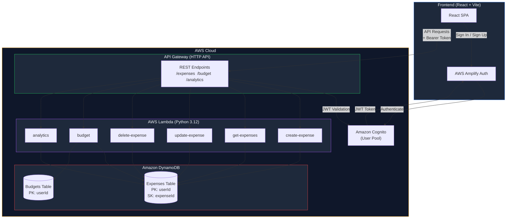
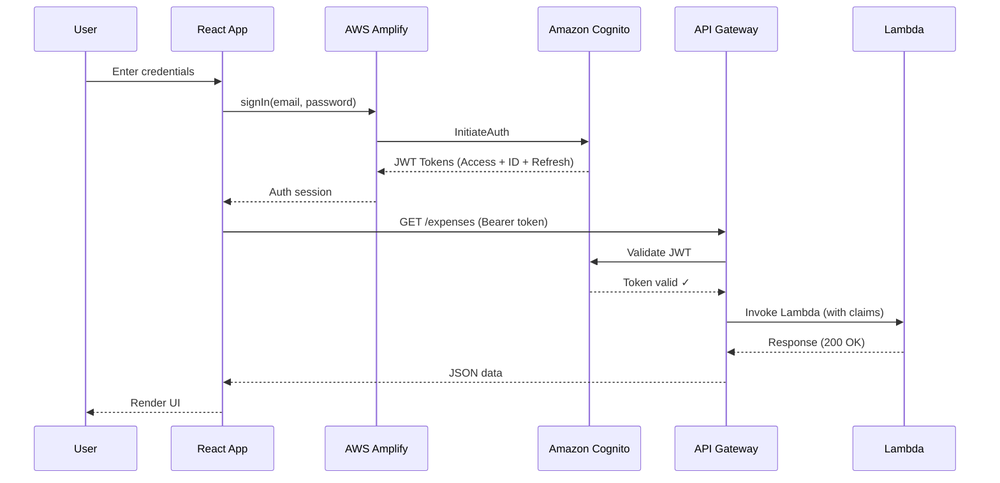

<div align="center">

# ☁️ CloudSpend

**A full-stack serverless expense tracking platform built on AWS**

[](LICENSE)
[](https://react.dev/)
[](https://vite.dev/)
[](https://aws.amazon.com/)
[](https://tailwindcss.com/)

[Features](#-features) · [Architecture](#-architecture) · [API](#-api-endpoints) · [Setup](#-local-setup) · [Deployment](#-deployment) · [Docs](#-documentation)

</div>

---

## 📋 Project Overview

CloudSpend is a production-grade, serverless expense tracking application that demonstrates real-world cloud engineering skills. Built with a **React + Vite** frontend and a **Python + AWS Lambda** backend, it provides users with a complete financial management experience — from expense tracking and budget management to spending analytics — all powered by a fully serverless AWS architecture.

This project showcases:

- **Serverless architecture** with AWS Lambda, API Gateway, DynamoDB, and Cognito
- **Secure authentication** using Amazon Cognito with JWT-based authorization
- **RESTful API design** with six Lambda functions handling CRUD operations and analytics
- **Modern frontend** built with React 19, Tailwind CSS v4, and Chart.js
- **Production patterns** including error handling, input validation, and CORS configuration

---

## ✨ Features

| Feature | Description |
|---------|-------------|
| 🔐 **Authentication** | Sign up, sign in, email verification, password reset via Amazon Cognito |
| 📊 **Dashboard** | Real-time financial overview with spending trends and budget progress |
| 💰 **Expense Management** | Full CRUD operations with search, filter, sort, and pagination |
| 📈 **Analytics** | Monthly, weekly, and yearly spending charts with category breakdown |
| 🎯 **Budget Tracking** | Set monthly budgets and track utilization with visual progress bars |
| 👤 **User Profile** | View account details and manage preferences |
| ⚙️ **Settings** | Currency, date format, and notification preferences |
| 🌙 **Dark Mode** | Sleek dark-themed UI designed for comfortable use |

---

## 🏗 Architecture



---

## ☁️ AWS Services

| Service | Purpose |
|---------|---------|
| **Amazon Cognito** | User authentication, sign-up/sign-in, JWT token management |
| **API Gateway** | HTTP API with JWT authorizer, CORS support, route management |
| **AWS Lambda** | Six Python 3.12 functions handling all backend business logic |
| **Amazon DynamoDB** | Two NoSQL tables — Expenses (composite key) and Budgets (simple key) |

---

## 🛠 Technology Stack

### Frontend

| Technology | Version | Purpose |
|-----------|---------|---------|
| React | 19 | UI component library |
| Vite | 8 | Build tool and dev server |
| Tailwind CSS | 4 | Utility-first CSS framework |
| AWS Amplify | 6 | Cognito authentication client |
| Chart.js | 4 | Data visualization (Line, Doughnut, Bar charts) |
| React Router | 7 | Client-side routing |
| Axios | 1.18 | HTTP client for API requests |
| Lucide React | 1.23 | Icon library |

### Backend

| Technology | Purpose |
|-----------|---------|
| Python 3.12 | Lambda runtime |
| Boto3 | AWS SDK for DynamoDB operations |

---

## 🔐 Authentication Flow



---

## 📡 API Endpoints

All endpoints require a valid JWT token in the `Authorization: Bearer <token>` header.

| Method | Endpoint | Lambda | Description |
|--------|----------|--------|-------------|
| `POST` | `/expenses` | create-expense | Create a new expense |
| `GET` | `/expenses` | get-expenses | List all user expenses |
| `PUT` | `/expenses/{id}` | update-expense | Update an existing expense |
| `DELETE` | `/expenses/{id}` | delete-expense | Delete an expense |
| `GET` | `/budget` | budget | Get current budget and spending |
| `POST` | `/budget` | budget | Set or update monthly budget |
| `GET` | `/analytics` | analytics | Get spending analytics and charts |

> See [docs/API.md](docs/API.md) for full request/response documentation.

---

## 📁 Folder Structure

```
serverless-expense-tracker/
├── backend/
│   ├── src/
│   │   ├── create_expense/     # POST /expenses
│   │   │   └── app.py
│   │   ├── get_expenses/       # GET /expenses
│   │   │   └── app.py
│   │   ├── update_expense/     # PUT /expenses/{id}
│   │   │   └── app.py
│   │   ├── delete_expense/     # DELETE /expenses/{id}
│   │   │   └── app.py
│   │   ├── budget/             # GET & POST /budget
│   │   │   └── app.py
│   │   ├── analytics/          # GET /analytics
│   │   │   └── app.py
│   │   └── shared/             # Shared utilities
│   │       ├── dynamodb.py
│   │       ├── response.py
│   │       └── validation.py
│   └── template.yaml           # CloudFormation (DynamoDB tables)
├── frontend/
│   ├── public/                 # Static assets
│   ├── src/
│   │   ├── components/         # Reusable UI components
│   │   │   ├── charts/         # Chart.js wrappers
│   │   │   └── ui/             # Buttons, Cards, Modals, etc.
│   │   ├── context/            # React Context providers
│   │   ├── data/               # Static data (categories)
│   │   ├── hooks/              # Custom React hooks
│   │   ├── layouts/            # Page layout components
│   │   ├── pages/              # Route page components
│   │   ├── services/           # API service layer
│   │   └── utils/              # Formatters and validators
│   ├── index.html
│   ├── vite.config.js
│   └── package.json
├── docs/                       # Documentation
├── architecture/               # Architecture diagrams
├── screenshots/                # Application screenshots
├── README.md
├── LICENSE
├── CONTRIBUTING.md
├── SECURITY.md
└── CODE_OF_CONDUCT.md
```

---

## 🚀 Local Setup

### Prerequisites

- [Node.js](https://nodejs.org/) v18 or later
- An AWS account with the following resources deployed:
  - Amazon Cognito User Pool
  - API Gateway HTTP API
  - Six Lambda functions (Python 3.12)
  - Two DynamoDB tables

### Installation

```bash
# Clone the repository
git clone https://github.com/vinaykumar0710/serverless-expense-tracker.git
cd serverless-expense-tracker/frontend

# Install dependencies
npm install

# Create environment file
cp .env.example .env
# Edit .env with your AWS resource IDs

# Start development server
npm run dev
```

The app will be available at `http://localhost:5173`.

---

## 🔧 Environment Variables

Create a `frontend/.env` file with the following variables:

| Variable | Description | Example |
|----------|-------------|---------|
| `VITE_AWS_REGION` | AWS region for Cognito and API Gateway | `ap-south-1` |
| `VITE_USER_POOL_ID` | Cognito User Pool ID | `ap-south-1_XXXXXXXXX` |
| `VITE_USER_POOL_CLIENT_ID` | Cognito App Client ID | `xxxxxxxxxxxxxxxxxxxxxxxxxx` |
| `VITE_API_URL` | API Gateway base URL | `https://xxxxxxxxxx.execute-api.ap-south-1.amazonaws.com/dev` |

---

## 📦 Deployment

### Frontend

```bash
cd frontend
npm run build    # Outputs to dist/
```

The `dist/` folder can be deployed to:
- **Amazon S3 + CloudFront** (recommended)
- **AWS Amplify Hosting**
- **Vercel** or **Netlify**

### Backend

Each Lambda function in `backend/src/` is deployed independently:

1. Package each function directory
2. Upload to AWS Lambda via the Console or AWS CLI
3. Configure environment variables (`EXPENSES_TABLE`, `BUDGETS_TABLE`)
4. Attach to API Gateway routes with Cognito JWT authorizer

> See [docs/DEPLOYMENT.md](docs/DEPLOYMENT.md) for detailed deployment instructions.

---

## 📸 Screenshots

> Replace the placeholder files in `screenshots/` with actual screenshots of your deployed application.

| Page | Screenshot |
|------|-----------|
| Login | `screenshots/01-login.png` |
| Dashboard | `screenshots/02-dashboard.png` |
| Expenses | `screenshots/03-expenses.png` |
| Add Expense | `screenshots/04-add-expense.png` |
| Budget | `screenshots/05-budget.png` |
| Analytics | `screenshots/06-analytics.png` |

---

## 📚 Documentation

| Document | Description |
|----------|-------------|
| [API Reference](docs/API.md) | Full endpoint documentation with request/response examples |
| [Architecture](docs/ARCHITECTURE.md) | System design and component interactions |
| [Deployment Guide](docs/DEPLOYMENT.md) | Step-by-step deployment instructions |
| [Troubleshooting](docs/TROUBLESHOOTING.md) | Common issues and solutions |
| [Architecture Diagram](architecture/architecture-diagram.md) | Mermaid-based architecture visualization |

---

## 💡 Lessons Learned

- **Serverless cold starts** — Lambda functions experience cold starts on the first invocation; Python 3.12 with 256 MB memory provides a good balance of cost and performance.
- **DynamoDB data types** — DynamoDB returns `Decimal` values for numbers, requiring frontend normalization to JavaScript `Number` types.
- **Cognito JWT integration** — API Gateway's built-in JWT authorizer eliminates the need for custom authorization middleware.
- **CORS configuration** — Both API Gateway and Lambda responses must include appropriate CORS headers for cross-origin browser requests.
- **Client-side pagination** — For small datasets, client-side search/filter/sort/pagination reduces backend complexity and API calls.

---

## 🔮 Future Improvements

- [ ] Add **recurring expenses** support
- [ ] Implement **expense export** (CSV / PDF)
- [ ] Add **multi-currency** support with exchange rate API
- [ ] Deploy infrastructure with **AWS CDK** or **Terraform**
- [ ] Add **CI/CD pipeline** with GitHub Actions
- [ ] Implement **unit tests** for Lambda functions (pytest)
- [ ] Add **frontend tests** with Vitest and React Testing Library
- [ ] Enable **CloudWatch dashboards** for Lambda monitoring
- [ ] Add **S3 receipt upload** for expense attachments

---

## 📄 License

This project is licensed under the [MIT License](LICENSE).

---

## 👤 Author

**Vinay Kumar**

- GitHub: [@vinaykumar0710](https://github.com/vinaykumar0710)

---

<div align="center">
  <sub>Built with ☁️ on AWS</sub>
</div>
