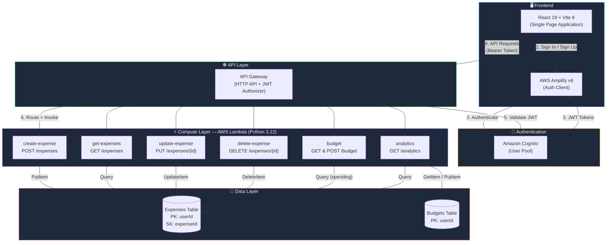
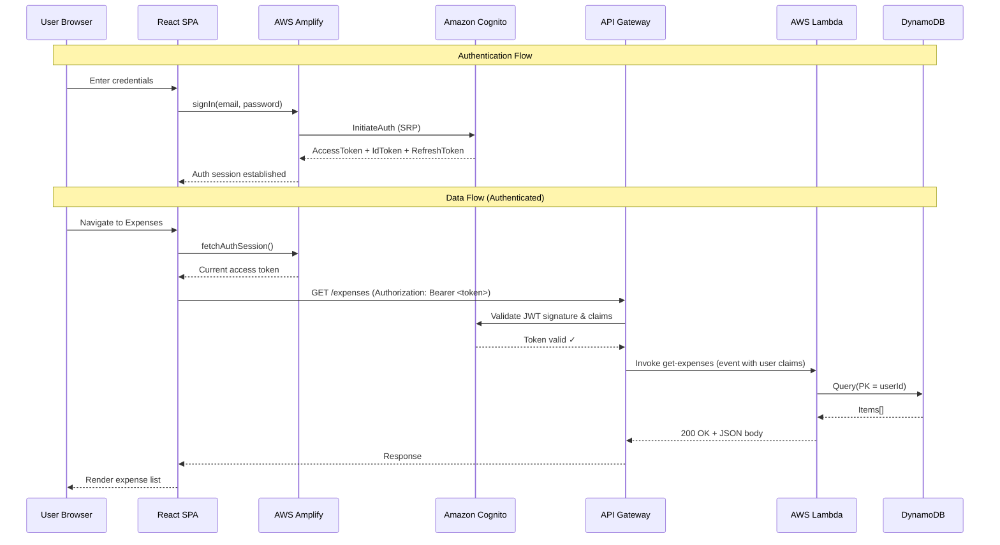

# CloudSpend — Architecture Diagram

## System Architecture



## Request Flow



## DynamoDB Table Design

```mermaid
erDiagram
    EXPENSES {
        string userId PK "Partition Key"
        string expenseId SK "Sort Key (UUID)"
        string title "Expense description"
        string category "food|travel|shopping|..."
        number amount "Decimal value"
        string date "YYYY-MM-DD"
        string notes "Optional notes"
        string createdAt "ISO 8601 timestamp"
        string updatedAt "ISO 8601 timestamp"
    }

    BUDGETS {
        string userId PK "Partition Key"
        number monthlyBudget "Monthly limit"
        string updatedAt "ISO 8601 timestamp"
    }

    EXPENSES }|--|| BUDGETS : "same userId"
```
