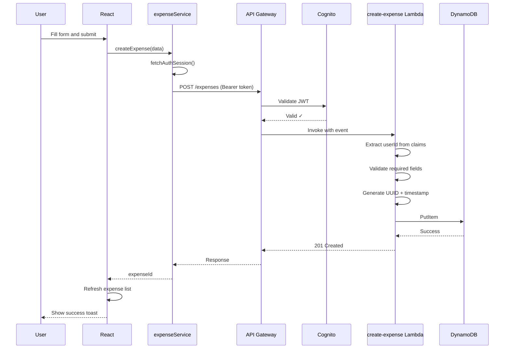

# 🏗 Architecture

This document describes the system architecture of CloudSpend, a serverless expense tracking application built on AWS.

---

## Overview

CloudSpend follows a **serverless architecture** where the frontend is a single-page application (SPA) and the backend consists of independent AWS Lambda functions orchestrated through Amazon API Gateway.

```
┌─────────────────┐    ┌─────────────────┐    ┌─────────────────┐
│   React + Vite  │───▶│  API Gateway    │───▶│  AWS Lambda     │
│   (Frontend)    │    │  (HTTP API)     │    │  (Python 3.12)  │
└─────────────────┘    └─────────────────┘    └────────┬────────┘
        │                      │                       │
        ▼                      ▼                       ▼
┌─────────────────┐    ┌─────────────────┐    ┌─────────────────┐
│  AWS Amplify    │    │ Amazon Cognito  │    │ Amazon DynamoDB │
│  (Auth Client)  │───▶│ (User Pool)    │    │ (NoSQL Tables)  │
└─────────────────┘    └─────────────────┘    └─────────────────┘
```

---

## Components

### Frontend — React SPA

| Aspect | Detail |
|--------|--------|
| **Framework** | React 19 with Vite 8 |
| **Styling** | Tailwind CSS v4 |
| **Auth** | AWS Amplify v6 (Cognito integration) |
| **HTTP** | Axios with JWT bearer tokens |
| **Charts** | Chart.js via react-chartjs-2 |
| **Routing** | React Router v7 with protected routes |

**Key Architectural Decisions:**

- **Client-side pagination/filtering**: All expenses are fetched from the API, then search, filter, sort, and pagination are applied client-side. This simplifies the backend and reduces the number of Lambda invocations.
- **Context-based state management**: React Context API is used instead of a heavier state management library (Redux, Zustand) since the state complexity is manageable.
- **Service layer pattern**: All API calls are encapsulated in service modules (`expenseService`, `budgetService`, `analyticsService`, `authService`), providing a clean separation between UI and data access.

### Authentication — Amazon Cognito

| Aspect | Detail |
|--------|--------|
| **Service** | Amazon Cognito User Pool |
| **Auth Flow** | Cognito Hosted UI / Amplify SDK |
| **Token Type** | JWT (Access Token) |
| **Verification** | API Gateway JWT Authorizer |

The authentication flow is:

1. User enters credentials in the React app
2. AWS Amplify SDK calls Cognito's `InitiateAuth` API
3. Cognito returns JWT tokens (Access, ID, Refresh)
4. The Access Token is attached to all API requests as a `Bearer` token
5. API Gateway validates the JWT before invoking Lambda functions
6. The Lambda receives the authenticated user's `sub` claim for data isolation

### API Layer — API Gateway

| Aspect | Detail |
|--------|--------|
| **Type** | HTTP API (v2) |
| **Authorization** | JWT Authorizer (Cognito) |
| **CORS** | Enabled for all origins (`*`) |
| **Stage** | `dev` |

**Routes:**

| Route | Method | Lambda |
|-------|--------|--------|
| `/expenses` | POST | create-expense |
| `/expenses` | GET | get-expenses |
| `/expenses/{expenseId}` | PUT | update-expense |
| `/expenses/{expenseId}` | DELETE | delete-expense |
| `/budget` | GET, POST | budget |
| `/analytics` | GET | analytics |

### Compute — AWS Lambda

All Lambda functions share the following configuration:

| Setting | Value |
|---------|-------|
| **Runtime** | Python 3.12 |
| **Architecture** | x86_64 |
| **Memory** | 256 MB |
| **Timeout** | 30 seconds |

Each function follows a consistent structure:

```python
# 1. Initialize DynamoDB resources outside the handler (connection reuse)
dynamodb = boto3.resource("dynamodb")
table = dynamodb.Table(os.environ["EXPENSES_TABLE"])

# 2. Handler extracts user ID from JWT claims
user_id = event["requestContext"]["authorizer"]["jwt"]["claims"]["sub"]

# 3. Perform DynamoDB operation
# 4. Return standardized response with CORS headers
```

### Database — Amazon DynamoDB

**Expenses Table** (`cloudspend-dev-expenses`):

| Key | Attribute | Type |
|-----|-----------|------|
| Partition Key | `userId` | String |
| Sort Key | `expenseId` | String |

**Budgets Table** (`cloudspend-dev-budgets`):

| Key | Attribute | Type |
|-----|-----------|------|
| Partition Key | `userId` | String |

Both tables use:
- **PAY_PER_REQUEST** billing (on-demand, no capacity planning)
- **Server-Side Encryption** (SSE)
- **Point-in-Time Recovery** (PITR)
- **Retain** deletion policy

---

## Data Flow

### Creating an Expense



---

## Security

| Layer | Mechanism |
|-------|-----------|
| **Authentication** | Amazon Cognito (managed user directory) |
| **Authorization** | JWT validation at API Gateway level |
| **Data Isolation** | All queries scoped by `userId` (partition key) |
| **Encryption** | DynamoDB SSE (AES-256), HTTPS in transit |
| **CORS** | Configured on both API Gateway and Lambda responses |

---

## Infrastructure as Code

The `backend/template.yaml` file defines the DynamoDB tables using AWS CloudFormation (SAM template format). Lambda functions are deployed independently via the AWS Console or CLI.

```yaml
# DynamoDB tables defined in template.yaml
- cloudspend-dev-expenses   (PK: userId, SK: expenseId)
- cloudspend-dev-budgets    (PK: userId)
```
